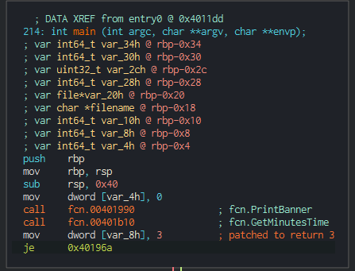

# Cyberlock - Medium 
---
We got a 64bit elf file:
```
 $ ./Cyberlock
[i] R2conCTF 2020 - CyberLock 1.3.3.7-alpha

     .--------.
    / .------. \
   / /        \ \
   | |        | |
  _| |________| |_
.' |_|        |_| '.
'._____ ____ _____.'
|     .'____'.     |
'.__.'.'    '.'.__.'
'.__  |!R2Con|  __.'
|   '.'.____.'.'   |
'.____'.____.'____.'
'.________________.'

[i] The r2con Cyberlock is the world's only quantum, military-grade, agile, blockchain backed, hardened, bullet-proof 12-pin digital cryptographic cyber lock.
[i] Hackers will never make it past the first pin!!!!

[!] Oh... we forgot to tell you that this secure lock can only be unlocked once per hour - ha ha ha! Come back at 3 minutes past the hour.
Exiting...
```

Let's open it in Cutter and look at main:


We can see it checks for 3 and quits otherwise. I chose to patch it to always 
return 3 and reversed the jump (as the condition is set by the `sub rsp, 0x40`).
A better solution would be to just patch `fcn.00401b10`, instead of this hacky mess.



Now let's try running it again:
```$ ./Cyberlock
[i] R2conCTF 2020 - CyberLock 1.3.3.7-alpha

     .--------.
    / .------. \
   / /        \ \
   | |        | |
  _| |________| |_
.' |_|        |_| '.
'._____ ____ _____.'
|     .'____'.     |
'.__.'.'    '.'.__.'
'.__  |!R2Con|  __.'
|   '.'.____.'.'   |
'.____'.____.'____.'
'.________________.'

[i] The r2con Cyberlock is the world's only quantum, military-grade, agile, blockchain backed, hardened, bullet-proof 12-pin digital cryptographic cyber lock.
[i] Hackers will never make it past the first pin!!!!

[i] Pin 1:      2E7D2C03A9507AE265ECF5B5356885A53393A2029D241394997265A1A25AEFC6 - BINGO!!!
[i] Pin 2:      454349E422F05297191EAD13E21D3DB520E5ABEF52055E4964B82FB213F593A1 - WRONG!!!
[i] WARNING - This unlock attempt has been logged and @pancake has been notified!!!

[i] 1/12 pins correct.
```
What's this? It seems there are 2 pins, without any input from us. They don't make much sense though, we'll take note that each is 64 chars and save them for later.

Let's continue looking into what the Cyberlock actually does:

Using the Ghidra decompiler plugin we get a nice readable function (as the code isn't obfuscated).
Simply put, ignoring the patched time contraint, there's a call to ProcessCodes with either an embedded string (`0x4040f0`) or the content of `/tmp/masterkey.in` if it exists. 

Looking at fcn.ProcessCodes, we can see a huge loop, that we can divide into 2 parts:


The first part is actually the end of the loop, checking if it reached the end of the input (or goto-ed) and whether all 12 pins were correct which will print the flag, or not and simply abort.


The 2nd part deals with breaking the input into 64 chars and validating each pin:


Some clean up was required as not everything was identified correctly, namely the `strcpy`, `strcat` and `sprintf` parameters. That can be accomplished by manually setting those address to strings (and adding *flags* for names).


Now things are a bit clearer, checking the documentation for `g_compute_checksum_for_string` we can see that `3` means `sha512`.
So each 64 char pin is appended with `"_3_r2con2020"`, hashed and compared against the correct hash.


Here is an equivalent snippet in python
```python
hashesArray = [...]
pins = [all_pins_string[i:i+64] for i in range(0, len(all_pins_string), 64)]
for idx, pin in enumerate(pins):
    hashed = hashlib.sha512(f'{pin}_3_r2con2020'.encode("utf-8")).hexdigest().upper()
    if hashed == hashesArray[idx]:
        print("BINGO!")
    else:
        print("WRONG!")
        break
```

---

So far the code seems pretty straightforward, and we already have 1 correct pin, only 11 more. But `11 * 64 = 704` characters might take us a while to bruteforce, so there must be another way to find them.

Let's look back at the 2 pins we got at the beginning:

`2E7D2C03A9507AE265ECF5B5356885A53393A2029D241394997265A1A25AEFC6`
`454349E422F05297191EAD13E21D3DB520E5ABEF52055E4964B82FB213F593A1`

I couldn't find any meaning or hint in them, so I googled them and it seems those are `sha256` hashes! Specifically: 

```
sha256('c') = 2E7D2C03A9507AE265ECF5B5356885A53393A2029D241394997265A1A25AEFC6 
sha256('r') = 454349E422F05297191EAD13E21D3DB520E5ABEF52055E4964B82FB213F593A1
```

In that case, there's a good change the rest of the pins are similar, that reduces our possible values to number of printable characters (~100).

```python
import string
hashes = ["D9259A378FC0EA75C1828369059854DEF76F91CABD01B56EF548C7ABA6441D59DD2DB9E51BD70C457179A123D53138F88132B29C691A9671F6C80E41E7D682A4",
"3F675784DABBC1330806CB4D5FE67860C25E103B75EB7B22821B2D75264B60C4D2E042A1726E1B85E3936A2A95E835E92FEFAC2C2E34A249109D98AED3962C71",
"BD605F0A10170EC1F7610BCF696C518AAB31C235CCF47866A71C332368BFE8B7E9FE4E3907B3CD37F111B40EEFFE89287C25033A41369A3236751474AD522537",
"B8CA8A22501EAB44AD44E6EB2F87791CA69955BFFC025988418866BDD8A1EAABA97F630A705D68B26370E49DAD9DE65AB478117C4289FFC240A8C85308D116A1",
"0694F2776E101C72092994B2F125973CBD3A608B3BA17CF8795DDDEEDE6773E0DE8D832EAE4EE3FF8C748FD6BDBC1BF843081CC6AEEFB09B1C908AD484382884",
"F9B4F710E8ADC5D4A32779A865396B019A630E2B1DB475F0F1656BC195ED2E0171932C9629DE5417F5C2D96FECC4B89107C9E28477513F98D5147391DF374C3C",
"B8CA8A22501EAB44AD44E6EB2F87791CA69955BFFC025988418866BDD8A1EAABA97F630A705D68B26370E49DAD9DE65AB478117C4289FFC240A8C85308D116A1",
"7280E46538FE2158921FA20E7A835E9F4900E8AFDA73E1D1EE03472E0B34D59AC28ABE964652B6EC8DF1B44D3F1B90A7684D470A191BB446FB2149918E69DE38",
"F08DF5E5DFDACE8892F03B4475263D72D6999DCC499C741028935D7D167222086F5FB63C793C20BA02E56AB74E901B1E66D178206E91B469F6055E63EE824D7F",
"9D9A2B793485D2ADF818DB5DF1D97CD1072F826845940780ECA50B623F8D931DC9533AF77DF2B811645B8B852670188A17736E8A536F672D5639EA40F2D1FC40",
"4AC1807EC58C1BD56D177E3F409FBD0FBCDE7D97F9F8A71469FD92817BB866B4D71A0DF10EB501AF6CE4439861E46B89473555B08874CEBA33312AD3495E84F2",
"0694F2776E101C72092994B2F125973CBD3A608B3BA17CF8795DDDEEDE6773E0DE8D832EAE4EE3FF8C748FD6BDBC1BF843081CC6AEEFB09B1C908AD484382884"]
all_pins = [hashlib.sha256(bytes(c.encode("utf-8"))).hexdigest().upper() for c in string.printable]
all_hashes = [hashlib.sha512(bytes(f'{pin}_3_r2con2020'.encode("utf-8"))).hexdigest().upper() for pin in all_pins]
masterkey = []
key = ""
for h in hashes:
    idx = all_hashes.index(h)
    pin = all_pins[idx]
    masterkey.append(pin)
    key += string.printable[idx]

print(key) # chaosMoNKeys    
open("/tmp/masterkey.in", "w").write("".join(masterkey))
```

Running the challenge again we get:
```
$ ./Cyberlock
[i] R2conCTF 2020 - CyberLock 1.3.3.7-alpha

     .--------.
    / .------. \
   / /        \ \
   | |        | |
  _| |________| |_
.' |_|        |_| '.
'._____ ____ _____.'
|     .'____'.     |
'.__.'.'    '.'.__.'
'.__  |!R2Con|  __.'
|   '.'.____.'.'   |
'.____'.____.'____.'
'.________________.'

[i] The r2con Cyberlock is the world's only quantum, military-grade, agile, blockchain backed, hardened, bullet-proof 12-pin digital cryptographic cyber lock.
[i] Hackers will never make it past the first pin!!!!

[i] Procesing input code...
[i] Pin 1:      2E7D2C03A9507AE265ECF5B5356885A53393A2029D241394997265A1A25AEFC6 - BINGO!!!
[i] Pin 2:      AAA9402664F1A41F40EBBC52C9993EB66AEB366602958FDFAA283B71E64DB123 - BINGO!!!
[i] Pin 3:      CA978112CA1BBDCAFAC231B39A23DC4DA786EFF8147C4E72B9807785AFEE48BB - BINGO!!!
[i] Pin 4:      65C74C15A686187BB6BBF9958F494FC6B80068034A659A9AD44991B08C58F2D2 - BINGO!!!
[i] Pin 5:      043A718774C572BD8A25ADBEB1BFCD5C0256AE11CECF9F9C3F925D0E52BEAF89 - BINGO!!!
[i] Pin 6:      08F271887CE94707DA822D5263BAE19D5519CB3614E0DAEDC4C7CE5DAB7473F1 - BINGO!!!
[i] Pin 7:      65C74C15A686187BB6BBF9958F494FC6B80068034A659A9AD44991B08C58F2D2 - BINGO!!!
[i] Pin 8:      8CE86A6AE65D3692E7305E2C58AC62EEBD97D3D943E093F577DA25C36988246B - BINGO!!!
[i] Pin 9:      86BE9A55762D316A3026C2836D044F5FC76E34DA10E1B45FEEE5F18BE7EDB177 - BINGO!!!
[i] Pin 10:     3F79BB7B435B05321651DAEFD374CDC681DC06FAA65E374E38337B88CA046DEA - BINGO!!!
[i] Pin 11:     A1FCE4363854FF888CFF4B8E7875D600C2682390412A8CF79B37D0B11148B0FA - BINGO!!!
[i] Pin 12:     043A718774C572BD8A25ADBEB1BFCD5C0256AE11CECF9F9C3F925D0E52BEAF89 - BINGO!!!

[i] 12/12 pins correct.
[i] Welcome back @pancake, using your master key: 2E7D2C03A9507AE265ECF5B5356885A53393A2029D241394997265A1A25AEFC6AAA9402664F1A41F40EBBC52C9993EB66AEB366602958FDFAA283B71E64DB123CA978112CA1BBDCAFAC231B39A23DC4DA786EFF8147C4E72B9807785AFEE48BB65C74C15A686187BB6BBF9958F494FC6B80068034A659A9AD44991B08C58F2D2043A718774C572BD8A25ADBEB1BFCD5C0256AE11CECF9F9C3F925D0E52BEAF8908F271887CE94707DA822D5263BAE19D5519CB3614E0DAEDC4C7CE5DAB7473F165C74C15A686187BB6BBF9958F494FC6B80068034A659A9AD44991B08C58F2D28CE86A6AE65D3692E7305E2C58AC62EEBD97D3D943E093F577DA25C36988246B86BE9A55762D316A3026C2836D044F5FC76E34DA10E1B45FEEE5F18BE7EDB1773F79BB7B435B05321651DAEFD374CDC681DC06FAA65E374E38337B88CA046DEAA1FCE4363854FF888CFF4B8E7875D600C2682390412A8CF79B37D0B11148B0FA043A718774C572BD8A25ADBEB1BFCD5C0256AE11CECF9F9C3F925D0E52BEAF89

[i] Flag: r2con{StopL0ckPickingY0urNos3}
```

I really enjoyed this challenge, thanks to @hexploitable and the r2con2020 CTF team :)